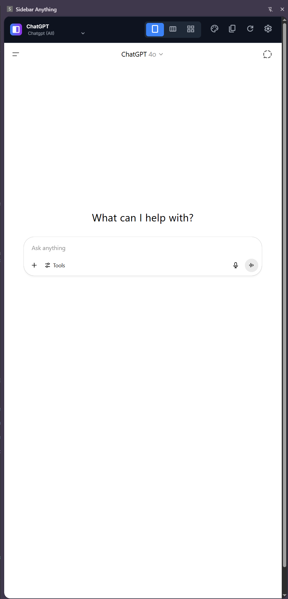
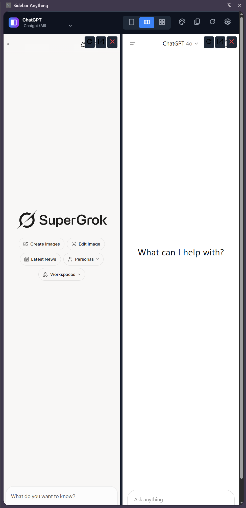
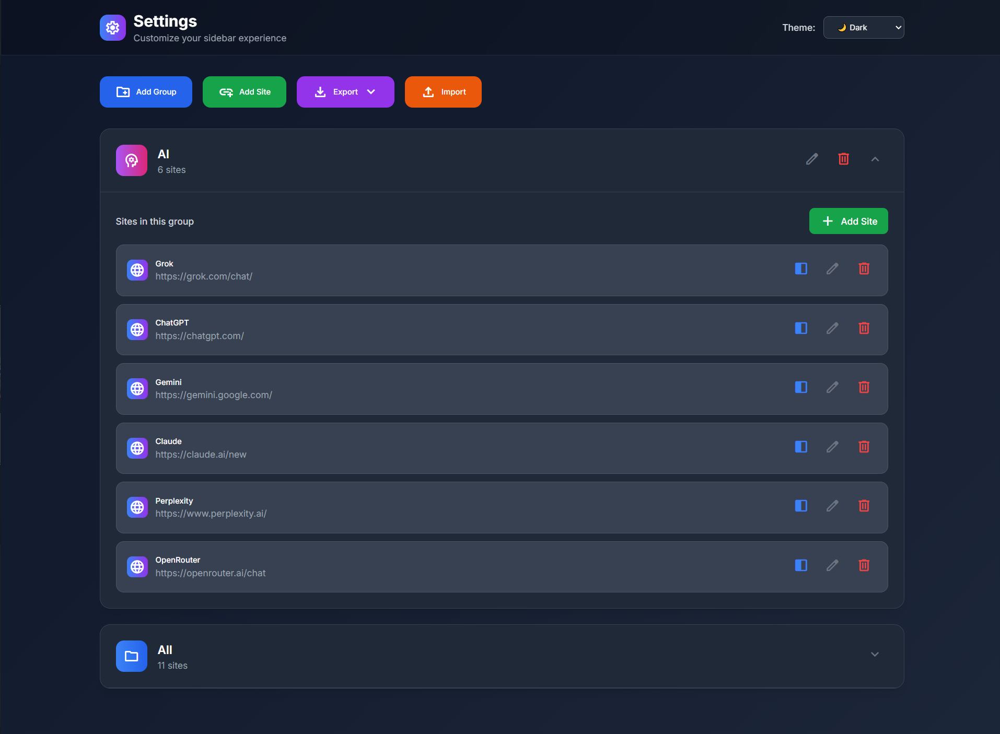
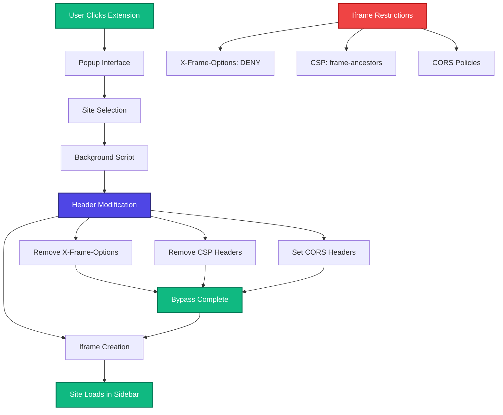
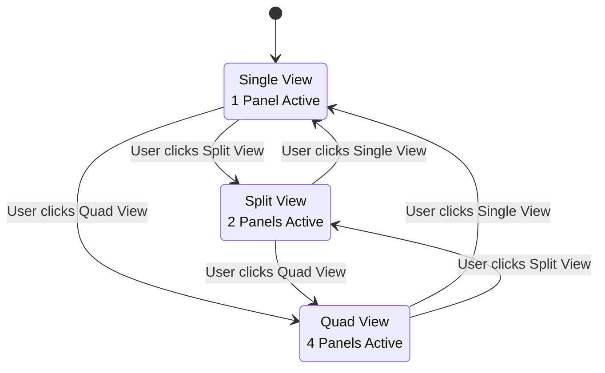

<div align="center">

# SidebarAnything

### *Transform your browser into a productivity powerhouse with instant access to any website in a sleek, customizable sidebar*

<div style="display: flex; justify-content: center; gap: 20px; margin-bottom: 20px;">
  
  
  
</div>

[](https://github.com/vibheksoni/SidebarAnything/releases)
[](https://opensource.org/licenses/MIT)
[](https://github.com/vibheksoni/SidebarAnything/stargazers)
[](https://github.com/vibheksoni/SidebarAnything/network)


---

**The Ultimate Chrome Extension for Seamless Multitasking**

*Load ANY website in a customizable sidebar • Bypass iframe restrictions • Multiple layout modes • Beautiful themes*

[Install Now](#installation) • [Quick Start](#quick-start) • [Contribute](#contributing) • [Star Us](#)

</div>

---

## What Makes SidebarAnything Revolutionary?

**Advanced Iframe Bypass Technology** - Unlike other sidebar extensions that fail with sites like ChatGPT, Claude, or Notion due to iframe restrictions, SidebarAnything uses sophisticated header modification techniques to load ANY website seamlessly.

SidebarAnything revolutionizes your browsing experience by providing instant access to your favorite websites without the chaos of tab juggling. Whether you're a developer consulting documentation, a researcher comparing sources, or an AI enthusiast switching between multiple tools, this extension is your productivity game-changer.

### Core Mission
**Empower users to keep their essential tools at their fingertips while maintaining focus on their primary workflow.**

### Why I Built SidebarAnything

As a developer constantly switching between documentation, AI tools, and reference materials, I was frustrated by the endless tab chaos that killed my productivity. Existing sidebar extensions failed miserably with modern sites like ChatGPT and Claude due to iframe restrictions, forcing me back to the tab-juggling nightmare.

**The breaking point came when I realized I was spending more time managing browser tabs than actually being productive.** I needed a solution that could:

- **Load ANY website** without iframe restrictions holding me back
- **Maintain my workflow** without constant context switching
- **Organize my tools** in a way that actually made sense
- **Look modern and professional** - not like extensions from 2015

After months of research into Chrome's latest APIs and countless iterations, SidebarAnything was born. It's not just another sidebar extension - it's a complete reimagining of how we interact with multiple web tools simultaneously.

**This extension exists because I believe your browser should work for you, not against you.** Every feature was designed to solve real productivity pain points that I experienced daily as a developer and that thousands of others face every day.

---

## Features That Set Us Apart

### **AI-First Design**
Pre-configured with the most popular AI tools for instant productivity:
- **ChatGPT** - OpenAI's conversational AI
- **Gemini** - Google's advanced AI model  
- **Claude** - Anthropic's helpful AI assistant
- **Perplexity** - AI-powered search engine
- **OpenRouter** - Access multiple AI models
- **Grok** - X's cutting-edge AI assistant

### **Stunning Visual Experience**
- **4 Beautiful Themes**: Light, Dark, Auto (system), and Premium (gradient magic)
- **Glassmorphism Effects**: Modern frosted glass design with backdrop blur
- **Smooth Animations**: Buttery-smooth transitions and micro-interactions
- **Responsive Design**: Perfect on any screen size
- **Premium Gradients**: Eye-catching indigo-to-purple gradients

### **Advanced Layout System**
- **Single View**: Focus mode for maximum productivity
- **Split View (2x1)**: Side-by-side comparison for research
- **Quad View (2x2)**: Ultimate multitasking setup for power users
- **Resizable Panels**: Drag handles to adjust panel sizes dynamically
- **Tab Management**: Switch between multiple sites with elegant tabs

### **Smart Organization**
- **Custom Groups**: Organize sites by project, category, or workflow
- **Drag & Drop**: Intuitive site management (coming soon)
- **Import/Export**: Backup configurations in JSON format
- **Smart Search**: Find sites instantly with real-time filtering
- **Quick Actions**: Right-click context menus for power users

### **Productivity Boosters**
- **Text Extraction**: Copy content from any loaded site with one click
- **Auto-Save**: Never lose your configuration with smart persistence
- **Reader Mode**: Distraction-free reading experience
- **Toast Notifications**: Beautiful feedback system with animations
- **Custom URLs**: Add any website on-the-fly

---

## Why SidebarAnything Dominates

```mermaid
graph TB
    A["SidebarAnything"] --> B["Universal Site Support"]
    A --> C["Advanced Layouts"]
    A --> D["AI-First Design"]
    A --> E["Modern UI/UX"]
    A --> F["Zero Performance Impact"]

    G["Other Extensions"] --> H["Limited Site Support"]
    G --> I["Basic Layouts Only"]
    G --> J["Generic Design"]
    G --> K["Outdated Interface"]
    G --> L["Resource Heavy"]

    style A fill:#4F46E5,stroke:#312E81,stroke-width:3px,color:#fff
    style G fill:#EF4444,stroke:#B91C1C,stroke-width:2px,color:#fff
    style B fill:#10B981,stroke:#047857,stroke-width:2px,color:#fff
    style C fill:#10B981,stroke:#047857,stroke-width:2px,color:#fff
    style D fill:#10B981,stroke:#047857,stroke-width:2px,color:#fff
    style E fill:#10B981,stroke:#047857,stroke-width:2px,color:#fff
    style F fill:#10B981,stroke:#047857,stroke-width:2px,color:#fff
    style H fill:#EF4444,stroke:#B91C1C,stroke-width:2px,color:#fff
    style I fill:#EF4444,stroke:#B91C1C,stroke-width:2px,color:#fff
    style J fill:#EF4444,stroke:#B91C1C,stroke-width:2px,color:#fff
    style K fill:#EF4444,stroke:#B91C1C,stroke-width:2px,color:#fff
    style L fill:#EF4444,stroke:#B91C1C,stroke-width:2px,color:#fff
```



| Feature | SidebarAnything | Sidekick | Workona | Arc Browser |
|---------|----------------|----------|---------|-------------|
| **Iframe Bypass** | ✅ Advanced | ❌ Limited | ❌ Basic | ⚠️ Partial |
| **AI Sites Support** | ✅ All Major | ❌ Few | ❌ None | ⚠️ Some |
| **Layout Options** | ✅ 3 Modes | ❌ 1 Mode | ❌ 2 Modes | ⚠️ 2 Modes |
| **Theme System** | ✅ 4 Themes | ❌ 2 Themes | ❌ 1 Theme | ⚠️ 2 Themes |
| **Performance** | ✅ Lightning Fast | ⚠️ Moderate | ❌ Slow | ⚠️ Heavy |
| **Customization** | ✅ Extensive | ❌ Limited | ❌ Basic | ⚠️ Moderate |
| **Text Extraction** | ✅ Built-in | ❌ None | ❌ None | ❌ None |

---

## Installation

**Pro Tip**: Enable Developer Mode first to unlock the full potential of browser extensions.

### Method 1: Chrome Web Store (Coming Soon)
```bash
# One-click install from Chrome Web Store
# Stay tuned for the official release!
```

### Method 2: Developer Installation (Available Now)

1. **Clone the Repository**
   ```bash
   git clone https://github.com/vibheksoni/SidebarAnything.git
   cd SidebarAnything
   ```

2. **Install Dependencies**
   ```bash
   npm install
   ```

3. **Build the Styles**
   ```bash
   npm run build
   ```

4. **Load in Chrome**
   - Open `chrome://extensions/`
   - Toggle **Developer mode** ON
   - Click **Load unpacked**
   - Select the `SidebarAnything` folder

**Security Notice**: Chrome may show security warnings for unpacked extensions. This is normal for developer installations and doesn't affect functionality.

---

## Quick Start

### Your First 60 Seconds with SidebarAnything

1. **Installation**: Follow the installation steps above
2. **Try AI Sites**: Click the extension icon → Select any AI tool from the dropdown
3. **Explore Layouts**: Use the layout buttons to switch between Single, Split, and Quad views
4. **Customize Theme**: Click the theme button to try Light, Dark, Auto, or Premium themes
5. **Add Custom Sites**: Use the "Custom URL" option to add any website

### Power User Tips

- **Premium Theme**: Unlock gradient backgrounds with glassmorphism effects
- **Layout Switching**: Seamlessly switch between layouts without losing loaded sites
- **Text Extraction**: Use the copy button to extract text from any loaded site
- **Reader Mode**: Toggle reader mode for distraction-free reading
- **Settings Page**: Access advanced configuration options

---

## Technical Architecture

### How SidebarAnything Works



### Core Technologies

- **Vanilla JavaScript**: Zero dependencies, maximum performance
- **Tailwind CSS**: Modern, utility-first styling with custom animations
- **Chrome APIs**: Storage, SidePanel, DeclarativeNetRequest, Scripting
- **Responsive Design**: Mobile-first approach with fluid layouts
- **CSS Animations**: Smooth, hardware-accelerated transitions
- **Chrome Storage**: Sync and local storage for data persistence

### The Iframe Restriction Problem

Most websites block iframe embedding using:
- `X-Frame-Options: DENY/SAMEORIGIN`
- `Content-Security-Policy: frame-ancestors`
- CORS restrictions and security policies

**Our Solution**: Advanced header modification using Chrome's `declarativeNetRequest` API to remove these restrictions while maintaining security.

```javascript
// Header modification implementation
async function setupHeaderModificationRules() {
  await chrome.declarativeNetRequest.updateDynamicRules({
    addRules: [{
      id: 9999,
      priority: 1,
      action: {
        type: "modifyHeaders",
        responseHeaders: [
          { header: "x-frame-options", operation: "remove" },
          { header: "content-security-policy", operation: "remove" },
          { header: "access-control-allow-origin", operation: "set", value: "*" }
        ]
      },
      condition: { resourceTypes: ["main_frame", "sub_frame"] }
    }]
  });
}
```

### Layout System Architecture



```javascript
// Layout switching implementation
async function switchLayout(layout) {
  currentLayout = layout;
  
  // Hide all views
  elements.singleView.classList.add('hidden');
  elements.splitView.classList.add('hidden');
  elements.quadView.classList.add('hidden');

  // Show selected view
  switch (layout) {
    case 'single':
      elements.singleView.classList.remove('hidden');
      break;
    case 'split-2':
      elements.splitView.classList.remove('hidden');
      break;
    case 'split-4':
      elements.quadView.classList.remove('hidden');
      break;
  }

  chrome.storage.local.set({ sidebarLayout: layout });
}
```

---

## Theme System

### Available Themes

| Theme | Description | Features |
|-------|-------------|----------|
| **🌞 Light** | Clean, minimal design | High contrast, easy on the eyes |
| **🌙 Dark** | Modern dark interface | Reduced eye strain, battery saving |
| **🔄 Auto** | Follows system preference | Seamless day/night transitions |
| **✨ Premium** | Gradient magic | Indigo-purple gradients, glassmorphism |

### Premium Theme Features

The Premium theme includes:
- **Gradient Backgrounds**: Beautiful indigo-to-purple gradients
- **Glassmorphism Effects**: Frosted glass with backdrop blur
- **Enhanced Animations**: Smoother transitions and micro-interactions
- **Premium Visual Elements**: Elevated design aesthetics

```css
/* Premium theme implementation */
.premium-gradient {
  background: linear-gradient(135deg, #667eea 0%, #764ba2 50%, #f093fb 100%);
}

.glass-effect {
  backdrop-filter: blur(16px);
  background: rgba(255, 255, 255, 0.1);
  border: 1px solid rgba(255, 255, 255, 0.2);
}
```

---

## Project Structure

```
SidebarAnything/
├── manifest.json          # Extension configuration
├── src/
│   └── input.css          # Tailwind CSS source
├── dist/
│   └── output.css         # Compiled CSS
├── popup.html             # Extension popup interface
├── popup.js               # Popup functionality
├── options.html           # Settings page
├── options.js             # Settings functionality
├── sidebar.html           # Main sidebar interface
├── sidebar.js             # Core sidebar logic
├── background.js          # Service worker
├── contentScript.js       # Content script for text extraction
├── package.json           # Dependencies and scripts
└── tailwind.config.js     # Tailwind configuration
```

---

## Configuration Options

### Settings Overview

| Setting | Options | Default | Description |
|---------|---------|---------|-------------|
| **Theme** | Light, Dark, Auto, Premium | Auto | Visual appearance |
| **Layout** | Single, Split-2, Split-4 | Single | Panel arrangement |
| **Groups** | Custom groups | All, AI | Site organization |
| **Import/Export** | JSON format | - | Data backup/restore |

### Advanced Configuration

**Layout Customization:**
- **Single View**: Perfect for focused work
- **Split View (2x1)**: Ideal for comparison tasks  
- **Quad View (2x2)**: Ultimate multitasking setup
- **Resizable Panels**: Drag to adjust sizes

**Theme Customization:**
- **Auto Theme**: Automatically switches based on system preference
- **Premium Theme**: Includes gradient backgrounds and glass effects
- **Custom CSS**: Modify styles in `src/input.css`

---

## Development

### Prerequisites

- **Node.js** (v14 or higher)
- **npm** (v6 or higher)
- **Chrome Browser** (v88 or higher)

### Development Setup

1. **Clone & Install**
   ```bash
   git clone https://github.com/vibheksoni/SidebarAnything.git
   cd SidebarAnything
   npm install
   ```

2. **Development Mode**
   ```bash
   npm run dev  # Watch mode for CSS changes
   ```

3. **Build for Production**
   ```bash
   npm run build  # One-time CSS build
   ```

### Available Scripts

| Script | Command | Description |
|--------|---------|-------------|
| **Build** | `npm run build` | Compile CSS once |
| **Dev** | `npm run dev` | Watch mode for development |
| **Build CSS** | `npm run build-css` | Same as dev (alias) |

### Development Workflow

1. **Make Changes**: Edit source files
2. **Build CSS**: Run `npm run dev` for watch mode
3. **Reload Extension**: Go to `chrome://extensions/` and click reload
4. **Test**: Verify functionality in browser

---

## Contributing

We welcome contributions from the community! Whether you're fixing bugs, adding features, or improving documentation, your help makes SidebarAnything better for everyone.

### How to Contribute

**Bug Reports**
1. Check existing issues to avoid duplicates
2. Create a detailed issue with:
   - Clear description of the problem
   - Steps to reproduce
   - Expected vs actual behavior
   - Browser version and OS
   - Screenshots if applicable

**Feature Requests**
1. Search existing requests first
2. Open a feature request with:
   - Clear description of the feature
   - Use case and benefits
   - Mockups or examples if possible

**Code Contributions**
1. Fork the repository
2. Create a feature branch: `git checkout -b feature/amazing-feature`
3. Make your changes following our coding standards
4. Test thoroughly across different scenarios
5. Commit with clear messages: `git commit -m 'Add amazing feature'`
6. Push to your fork: `git push origin feature/amazing-feature`
7. Open a Pull Request with detailed description

### Development Guidelines

- **Code Style**: Follow existing patterns and use meaningful variable names
- **Comments**: Document complex logic and public functions
- **Testing**: Test your changes across different browsers and scenarios
- **Performance**: Keep the extension lightweight and fast
- **Security**: Never compromise user data or browser security

---

## Privacy & Security

### Privacy First

SidebarAnything is designed with privacy as a core principle:

- **Local Storage Only**: All data stays on your device
- **No Tracking**: We don't collect any personal information
- **No External Servers**: No data is sent to external services
- **Open Source**: Full transparency - inspect the code yourself

### Security Features

- **Secure Header Modification**: Only removes necessary headers for functionality
- **Sandboxed Iframes**: Sites run in isolated environments
- **Minimal Permissions**: Only requests necessary Chrome permissions
- **Content Script Isolation**: Limited access to page content

### Permissions Explained

| Permission | Purpose | Why We Need It |
|------------|---------|----------------|
| **storage** | Save user preferences | Store groups, sites, and settings |
| **sidePanel** | Create sidebar interface | Core functionality |
| **scripting** | Text extraction | Copy content from loaded sites |
| **tabs** | Tab management | Open sites in sidebar |
| **declarativeNetRequest** | Bypass iframe restrictions | Load restricted sites |
| **host_permissions** | Access all URLs | Load any website in sidebar |

---

## Roadmap

### Version 2.0 (Coming Soon)

**Core Features**
- **Keyboard Shortcuts**: Lightning-fast navigation
- **Global Search**: Find any site across all groups instantly
- **Mobile Support**: Responsive design for mobile browsers
- **Enhanced Onboarding**: Interactive tutorials with animations
- **Usage Analytics**: Optional, privacy-focused usage insights

**UI/UX Enhancements**
- **Custom Themes**: User-created theme system
- **Advanced Animations**: More fluid transitions and micro-interactions
- **Responsive Layouts**: Better mobile and tablet support
- **Custom Backgrounds**: Upload your own backgrounds
- **Particle Effects**: Optional visual enhancements

**Performance & Features**
- **Faster Loading**: Optimized iframe loading and caching
- **Cloud Sync**: Optional cloud backup for settings
- **Auto-Update**: Automatic site list updates
- **Smart Suggestions**: AI-powered site recommendations
- **Productivity Tools**: Built-in notes and task management

### Future Vision (v3.0+)

- **AI Integration**: Smart site organization and recommendations
- **Cross-Browser Support**: Firefox, Safari, Edge compatibility
- **Mobile App**: Companion mobile application
- **API Integration**: Connect with external productivity tools
- **Gamification**: Achievement system for productivity

---

## Support & Community

### Getting Help

- **Documentation**: Check this README for comprehensive guides
- **Issues**: [GitHub Issues](https://github.com/vibheksoni/SidebarAnything/issues) for bugs and feature requests
- **Discussions**: [GitHub Discussions](https://github.com/vibheksoni/SidebarAnything/discussions) for questions and ideas
- **Email**: Contact the maintainer for direct support

### Show Your Support

If SidebarAnything has improved your productivity, consider:

- **Star this repository** to show your appreciation
- **Share on social media** to help others discover it
- **Contribute** by reporting bugs or suggesting features
- **Write a review** when it's available on Chrome Web Store

---

## License

This project is licensed under the **MIT License** - see the [LICENSE](LICENSE) file for details.

### What This Means

- **Commercial Use**: Use in commercial projects
- **Modification**: Modify and distribute
- **Distribution**: Share with others
- **Private Use**: Use for personal projects
- **Liability**: No warranty or liability
- **Trademark Use**: Cannot use project trademarks

---

## Acknowledgments

### Special Thanks to:

- **Tailwind CSS Team**: For the amazing utility-first CSS framework
- **Chrome Extensions Team**: For powerful APIs and documentation
- **Open Source Community**: For inspiration and best practices
- **Beta Testers**: For valuable feedback and bug reports
- **Contributors**: Everyone who has helped improve SidebarAnything

### Built With

- [Tailwind CSS](https://tailwindcss.com/) - Utility-first CSS framework
- [Chrome Extensions API](https://developer.chrome.com/docs/extensions/) - Browser extension platform
- [Mermaid](https://mermaid-js.github.io/) - Diagram and flowchart generation

---

<div align="center">

## Ready to Transform Your Browsing Experience?

### [Install SidebarAnything Now](#installation)

**Join the productivity revolution and take control of your browser!**

[](https://github.com/vibheksoni/SidebarAnything/stargazers)
[](https://github.com/vibheksoni/SidebarAnything/network)

---

**Made with ❤️ by [Vibhek Soni](https://github.com/vibheksoni)**

*Star this repo if SidebarAnything has made your life easier! ⭐*

</div>